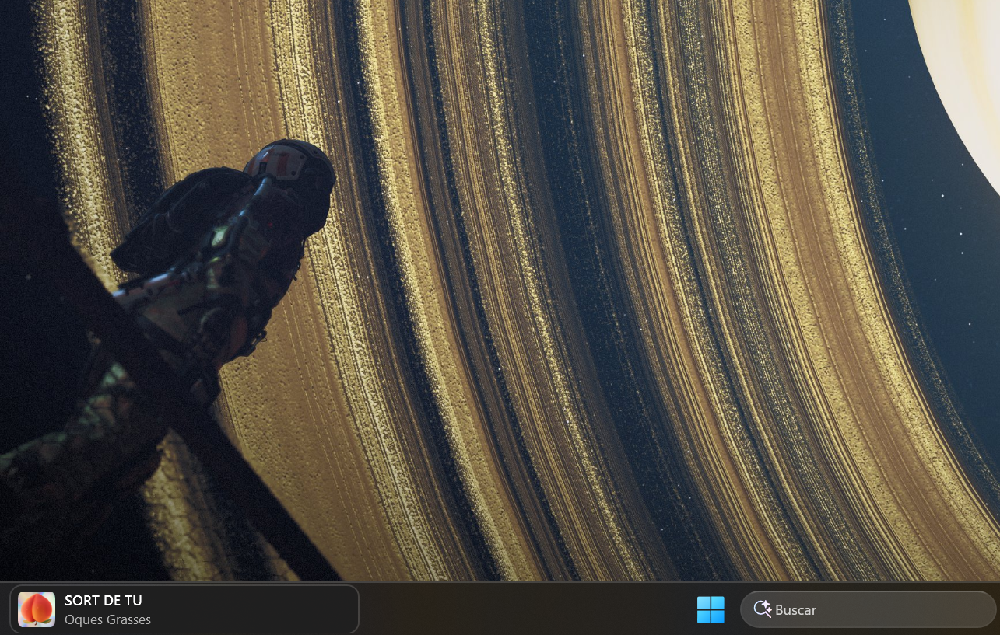

# Windows MiniPlayer

A tiny always-on-top bar that floats just above the Windows 11 taskbar and shows
whatever is currently playing through the system media controls — Spotify, Edge,
Chrome, Firefox, VLC, Groove, and anything else that shows up in the volume
flyout's media popup.

Windows 11 has no supported way to put content *inside* the taskbar, so this is a
separate borderless window that tracks the taskbar's position and pins itself to
its leading edge.



## Features

- Album art + title + artist, updated live as the track changes
- Click the bar (or the middle button) to play/pause
- Prev / play-pause / next buttons fade in on hover
- Mouse wheel over the bar = previous / next track
- Right-click for:
  - **Monitor** → pick which display's taskbar to dock to (only shown when more
    than one taskbar is detected)
  - **Position** → *Above taskbar* (floats in the gap just outside it) or
    *On taskbar* (overlaps the taskbar near its leading corner)
  - **Size** → *Compact* / *Default* / *Large* bar presets
  - **Theme** → *Match system* / *Light* / *Dark*
  - **Draggable** → left-drag the bar anywhere; the spot is remembered
  - **Start with Windows** (per-user `HKCU\...\Run` entry)
  - **Exit**
- Follows the taskbar across resolution / DPI / taskbar-position changes, on
  whichever monitor you pick — including auto-hidden taskbars, which it tracks
  in real time as they slide in and out
- Never takes focus (`WS_EX_NOACTIVATE`), hidden from Alt-Tab, not in the taskbar
- Collapses to nothing when no media session is active
- A tray icon gives access to the same menu (plus a **Reset position** recovery
  action) even while the bar itself is collapsed or has been dragged off-screen

## Settings

Menu choices persist to `%APPDATA%\WindowsMiniPlayer\settings.json`
(position mode, monitor, size, theme, draggable on/off, last dragged
coordinates). Delete the file to reset to defaults.

**"Start with Windows" writes the *current* exe's path** to the registry. If you
run it straight from `bin\Debug\...` or `bin\Release\...`, that path shifts
whenever the target framework/RID changes (as it did once already) and the
autostart entry silently points at a stale, frozen build. To avoid that, publish
a copy to a stable folder outside the build tree once, and re-run this after any
update you want reflected at next login:

```powershell
dotnet publish -c Release -o "$env:LOCALAPPDATA\WindowsMiniPlayer"
```

Then toggle **Start with Windows** off/on from that copy so the registry entry
points at it.

## Privacy

Runs entirely locally. It reads the current media-session metadata through the
Windows `GlobalSystemMediaTransportControlsSessionManager` API and writes a
settings file plus one optional registry value (the "Start with Windows" entry).
**No network calls, no telemetry, no analytics.**

## Requirements

- Windows 10 1809+ or Windows 11
- To run: [.NET Desktop Runtime 8](https://dotnet.microsoft.com/download/dotnet/8.0)
  (or grab a self-contained build from Releases, which bundles it)
- To build: .NET 8 SDK — `winget install Microsoft.DotNet.SDK.8`

## Build & run

```powershell
cd WinMiniPlayer
dotnet nuget locals all --clear
dotnet restore
dotnet build
dotnet run
```

### Self-contained single file

```powershell
dotnet publish -c Release -r win-x64 -p:PublishSingleFile=true -p:SelfContained=true `
  -p:IncludeNativeLibrariesForSelfExtract=true -p:EnableCompressionInSingleFile=true
```

Use `-r win-arm64` for ARM64 (Snapdragon) devices. The result is one
`MiniPlayer.exe` under
`bin\Release\net8.0-windows10.0.19041.0\<rid>\publish\`. Copy it anywhere and
make a shortcut, or use the right-click **Start with Windows** toggle.

For a much smaller binary that needs the .NET Desktop Runtime 8 installed, drop
`-p:SelfContained=true` (and the compression flag).

### Releases & code signing

On a `v*` tag the CI builds self-contained single-file zips for `win-x64` and
`win-arm64`, generates a `SHA256SUMS` file for each, and attaches them to a
GitHub Release. The version stamped into the exe comes from the tag name.

To avoid the "Windows protected your PC" SmartScreen prompt, configure a
code-signing certificate as two repository secrets (base64-encoded `.pfx` and
its password). The signing step is skipped automatically when they are absent:

- `CODE_SIGNING_PFX`
- `CODE_SIGNING_PASSWORD`

## How it works

| File | Role |
| --- | --- |
| [`Services/MediaService.cs`](Services/MediaService.cs) | Wraps `GlobalSystemMediaTransportControlsSessionManager`; raises a `NowPlaying` snapshot on any track/playback change (debounced) |
| [`Services/TaskbarTracker.cs`](Services/TaskbarTracker.cs) | Resolves the taskbar for the selected monitor via `NativeMethods.TryGetAllTaskbars`, positions the window in physical pixels with `SetWindowPos`, re-checks every 200ms (fast enough to follow an auto-hide slide) + on display-change events |
| [`Services/ThemeService.cs`](Services/ThemeService.cs) | Reads the taskbar's light/dark registry setting and raises a change event when it flips |
| [`Services/TrayService.cs`](Services/TrayService.cs) | The notification-area icon and its menu (`ITrayHost` drives it from the same state as the bar's own menu) |
| [`Services/StartupManager.cs`](Services/StartupManager.cs) | Toggles the `HKCU` Run-key entry |
| [`Services/Settings.cs`](Services/Settings.cs) | Loads/saves `settings.json` (position, monitor, size, theme, draggable, custom coords) |
| [`Interop/NativeMethods.cs`](Interop/NativeMethods.cs) | P/Invoke declarations, including primary + secondary-monitor taskbar discovery |
| [`MainWindow.xaml`](MainWindow.xaml) / [`.cs`](MainWindow.xaml.cs) | The bar UI, menu, and drag handling |

## Known limitations

- Fullscreen apps (games, video) cover the bar — expected for a topmost window
- Bar size only has three presets (Compact/Default/Large) in the menu; exact
  pixel dimensions still require editing `Settings.cs`'s defaults

## Why not *inside* the taskbar?

Windows 10 supported "deskbands" (COM toolbars hosted in the taskbar). Windows 11's
rewritten taskbar dropped that API, and there is no supported replacement.
Getting truly inside the Win11 taskbar today means either a third-party taskbar
replacement (ExplorerPatcher, StartAllBack, Start11) that restores deskband
hosting, or unsupported `SetParent` reparenting that breaks on every Explorer
restart. A tracked floating bar is the trade-off this project makes.

## License

[MIT](LICENSE) © Javier Boix
